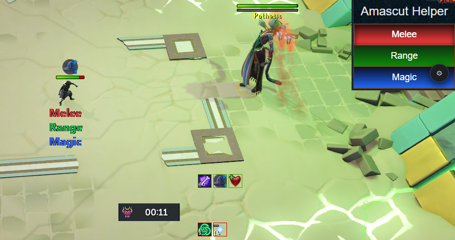

# Amascut Helper by Saltea (credit to Ellam + Duk)



An **Alt1 Toolkit** app to assist with **Hardmode Amascut** mechanics in RuneScape.
This tool listens to in-game chat for Amascut's special callouts and provides clear, real-time instructions so you can focus on the fight.

---

## Features

* **Hardmode Specific** – Tailored for Hardmode Amascut mechanics. May work in Normal Mode but is not guaranteed.
* **Mechanic Callouts** – Detects chat lines from Amascut and displays what style you should pray for.
* **Deity Location Tracking** – Shows Hardmode deity locations when Amascut calls them out.
* **Movable Overlay** – Drag the UI anywhere on your screen; position persists between sessions.
* **Lightweight & Non-Intrusive** – Fully runs in Alt1 with minimal overhead.

---

## How It Works

1. **Finds Your Chatbox** – The app locates your RuneScape chatbox in Alt1.
2. **Reads Specific Colors** – It listens for Amascut's lines using the known chat color codes.
3. **Matches Trigger Phrases** – Each mechanic is tied to a specific trigger phrase.
4. **Updates the Overlay** – The floating overlay updates instantly with style, deity, or mechanic info.
5. **Optional Toggles** – Configure which elements you want visible.

---

## Special Callouts

In addition to standard mechanics, this app handles Hardmode deity location lines:

| Amascut's Line                                 | Displayed In App |
| ---------------------------------------------- | ---------------- |
| `Crondis... It should have never come to this` | `Crondis (SE)`   |
| `I'm sorry, Apmeken`                           | `Apmeken (NW)`   |
| `Forgive me, Het`                              | `Het (SW)`       |
| `Scabaras...`                                  | `Scabaras (NE)`  |

---

## Installation

**Install automatically in Alt1:**

```
alt1://addapp/https://rssaltea.github.io/amascut-helper/appconfig.json
```

**Manual install:**

1. Download this repo or the `app` folder.
2. In Alt1, click the cog → **Add from File** → select `appconfig.json`.

---

## Usage

* Open the app in Alt1.
* Ensure your chatbox is visible in a standard format Alt1 can read.
* Move/resize the overlay as you like.
* Toggle optional features in the UI.
* Fight Amascut—your overlay updates automatically.

---

## Notes

* Developed for **Hardmode**.
* Normal mode may work but is not guaranteed.
* For issues or suggestions, DM **`.saltea`** on Discord.

---

## License

Free to use or modify. Please credit if redistributed.
